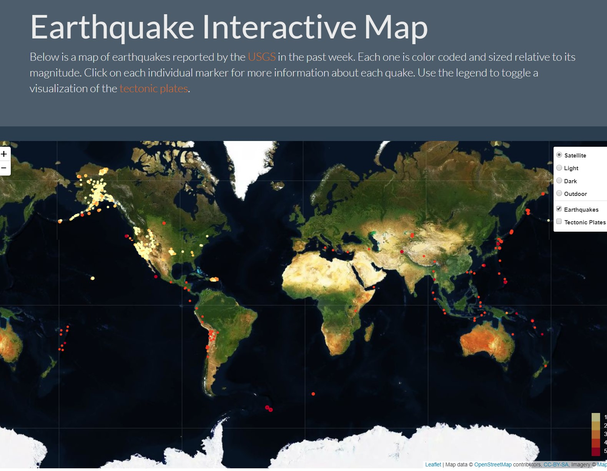

# Unit 17 | Assignment - Visualizing Data with Leaflet

Using JSON data published by the the <a href="https://earthquake.usgs.gov/earthquakes/feed/v1.0/geojson.php"> United States Geological Survey</a>, we created an interactive map of earthquakes in the past week. Each quake is plotted on a world map with color and size relative to its magnitude. Click on each circle for more information about individual quakes.  In addition, we created a layer to display tectonic plates that can be toggled on and off.  Data for tectonic plates were obtained from <a href="https://github.com/fraxen/tectonicplates"> this repository </a>.

See results here:
https://grean1010.github.io/Mapping/index.html

Code and supporting documentation can be found in this repository.

